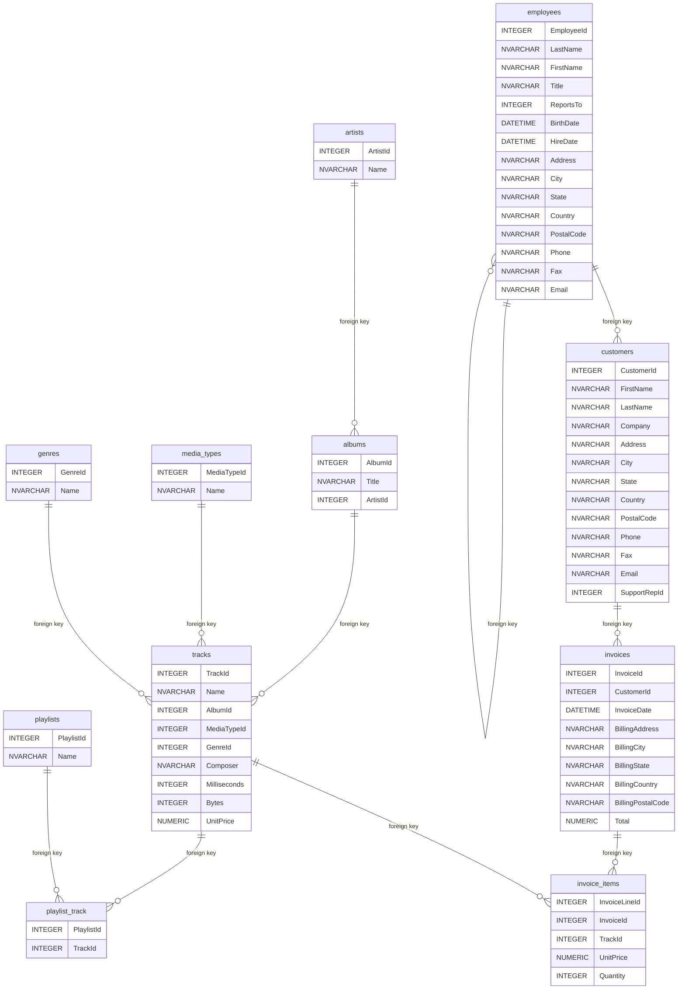

# Mermaid Example

## Example

```mermaid
erDiagram

  artists {
    INTEGER ArtistId
    NVARCHAR Name
  }

  employees {
    INTEGER EmployeeId
    NVARCHAR LastName
    NVARCHAR FirstName
    NVARCHAR Title
    INTEGER ReportsTo
    DATETIME BirthDate
    DATETIME HireDate
    NVARCHAR Address
    NVARCHAR City
    NVARCHAR State
    NVARCHAR Country
    NVARCHAR PostalCode
    NVARCHAR Phone
    NVARCHAR Fax
    NVARCHAR Email
  }

  genres {
    INTEGER GenreId
    NVARCHAR Name
  }

  media_types {
    INTEGER MediaTypeId
    NVARCHAR Name
  }

  playlists {
    INTEGER PlaylistId
    NVARCHAR Name
  }

  albums {
    INTEGER AlbumId
    NVARCHAR Title
    INTEGER ArtistId
  }

  customers {
    INTEGER CustomerId
    NVARCHAR FirstName
    NVARCHAR LastName
    NVARCHAR Company
    NVARCHAR Address
    NVARCHAR City
    NVARCHAR State
    NVARCHAR Country
    NVARCHAR PostalCode
    NVARCHAR Phone
    NVARCHAR Fax
    NVARCHAR Email
    INTEGER SupportRepId
  }

  invoices {
    INTEGER InvoiceId
    INTEGER CustomerId
    DATETIME InvoiceDate
    NVARCHAR BillingAddress
    NVARCHAR BillingCity
    NVARCHAR BillingState
    NVARCHAR BillingCountry
    NVARCHAR BillingPostalCode
    NUMERIC Total
  }

  tracks {
    INTEGER TrackId
    NVARCHAR Name
    INTEGER AlbumId
    INTEGER MediaTypeId
    INTEGER GenreId
    NVARCHAR Composer
    INTEGER Milliseconds
    INTEGER Bytes
    NUMERIC UnitPrice
  }

  invoice_items {
    INTEGER InvoiceLineId
    INTEGER InvoiceId
    INTEGER TrackId
    NUMERIC UnitPrice
    INTEGER Quantity
  }

  playlist_track {
    INTEGER PlaylistId
    INTEGER TrackId
  }

  artists ||--o{ albums : "foreign key"

  employees ||--o{ customers : "foreign key"
  employees ||--o{ employees : "foreign key"

  genres ||--o{ tracks : "foreign key"

  media_types ||--o{ tracks : "foreign key"

  playlists ||--o{ playlist_track : "foreign key"

  albums ||--o{ tracks : "foreign key"

  customers ||--o{ invoices : "foreign key"

  invoices ||--o{ invoice_items : "foreign key"

  tracks ||--o{ invoice_items : "foreign key"
  tracks ||--o{ playlist_track : "foreign key"

```