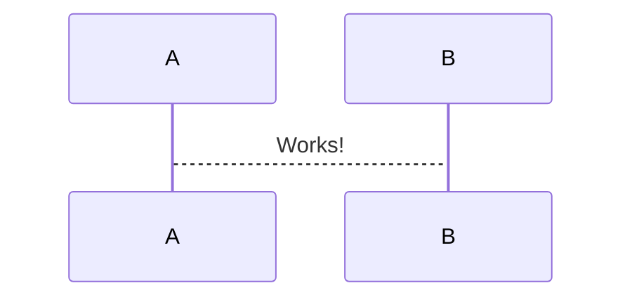
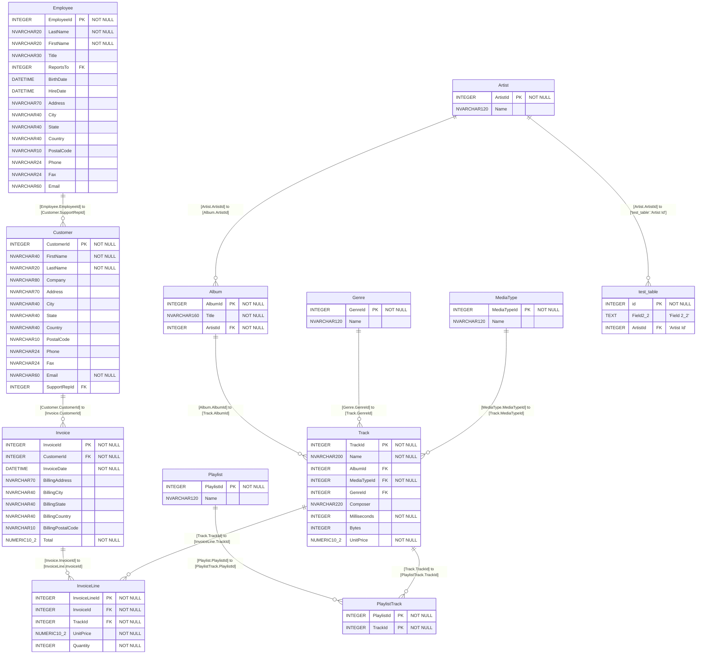

# Mermaid Example

## Example

```mermaid
sequenceDiagram
  A-->B: Works!
```

```mermaid
erDiagram

  Artist {
    INTEGER ArtistId PK "NOT NULL"
    NVARCHAR120 Name
  }

  Employee {
    INTEGER EmployeeId PK "NOT NULL"
    NVARCHAR20 LastName "NOT NULL"
    NVARCHAR20 FirstName "NOT NULL"
    NVARCHAR30 Title
    INTEGER ReportsTo FK
    DATETIME BirthDate
    DATETIME HireDate
    NVARCHAR70 Address
    NVARCHAR40 City
    NVARCHAR40 State
    NVARCHAR40 Country
    NVARCHAR10 PostalCode
    NVARCHAR24 Phone
    NVARCHAR24 Fax
    NVARCHAR60 Email
  }

  Genre {
    INTEGER GenreId PK "NOT NULL"
    NVARCHAR120 Name
  }

  MediaType {
    INTEGER MediaTypeId PK "NOT NULL"
    NVARCHAR120 Name
  }

  Playlist {
    INTEGER PlaylistId PK "NOT NULL"
    NVARCHAR120 Name
  }

  Album {
    INTEGER AlbumId PK "NOT NULL"
    NVARCHAR160 Title "NOT NULL"
    INTEGER ArtistId FK "NOT NULL"
  }

  Customer {
    INTEGER CustomerId PK "NOT NULL"
    NVARCHAR40 FirstName "NOT NULL"
    NVARCHAR20 LastName "NOT NULL"
    NVARCHAR80 Company
    NVARCHAR70 Address
    NVARCHAR40 City
    NVARCHAR40 State
    NVARCHAR40 Country
    NVARCHAR10 PostalCode
    NVARCHAR24 Phone
    NVARCHAR24 Fax
    NVARCHAR60 Email "NOT NULL"
    INTEGER SupportRepId FK
  }

  test_table {
    INTEGER id PK "NOT NULL"
    TEXT Field2_2 "'Field 2_2'"
    INTEGER ArtistId FK "'Artist Id'"
  }

  Invoice {
    INTEGER InvoiceId PK "NOT NULL"
    INTEGER CustomerId FK "NOT NULL"
    DATETIME InvoiceDate "NOT NULL"
    NVARCHAR70 BillingAddress
    NVARCHAR40 BillingCity
    NVARCHAR40 BillingState
    NVARCHAR40 BillingCountry
    NVARCHAR10 BillingPostalCode
    NUMERIC10_2 Total "NOT NULL"
  }

  Track {
    INTEGER TrackId PK "NOT NULL"
    NVARCHAR200 Name "NOT NULL"
    INTEGER AlbumId FK
    INTEGER MediaTypeId FK "NOT NULL"
    INTEGER GenreId FK
    NVARCHAR220 Composer
    INTEGER Milliseconds "NOT NULL"
    INTEGER Bytes
    NUMERIC10_2 UnitPrice "NOT NULL"
  }

  InvoiceLine {
    INTEGER InvoiceLineId PK "NOT NULL"
    INTEGER InvoiceId FK "NOT NULL"
    INTEGER TrackId FK "NOT NULL"
    NUMERIC10_2 UnitPrice "NOT NULL"
    INTEGER Quantity "NOT NULL"
  }

  PlaylistTrack {
    INTEGER PlaylistId PK "NOT NULL"
    INTEGER TrackId PK "NOT NULL"
  }

  Artist ||--o{ Album : "[Artist.ArtistId] to [Album.ArtistId]"

  Employee ||--o{ Customer : "[Employee.EmployeeId] to [Customer.SupportRepId]"

  Artist ||--o{ test_table : "[Artist.ArtistId] to ['test_table'.'Artist Id']"

  Customer ||--o{ Invoice : "[Customer.CustomerId] to [Invoice.CustomerId]"

  Album ||--o{ Track : "[Album.AlbumId] to [Track.AlbumId]"
  Genre ||--o{ Track : "[Genre.GenreId] to [Track.GenreId]"
  MediaType ||--o{ Track : "[MediaType.MediaTypeId] to [Track.MediaTypeId]"

  Invoice ||--o{ InvoiceLine : "[Invoice.InvoiceId] to [InvoiceLine.InvoiceId]"
  Track ||--o{ InvoiceLine : "[Track.TrackId] to [InvoiceLine.TrackId]"

  Playlist ||--o{ PlaylistTrack : "[Playlist.PlaylistId] to [PlaylistTrack.PlaylistId]"
  Track ||--o{ PlaylistTrack : "[Track.TrackId] to [PlaylistTrack.TrackId]"


```